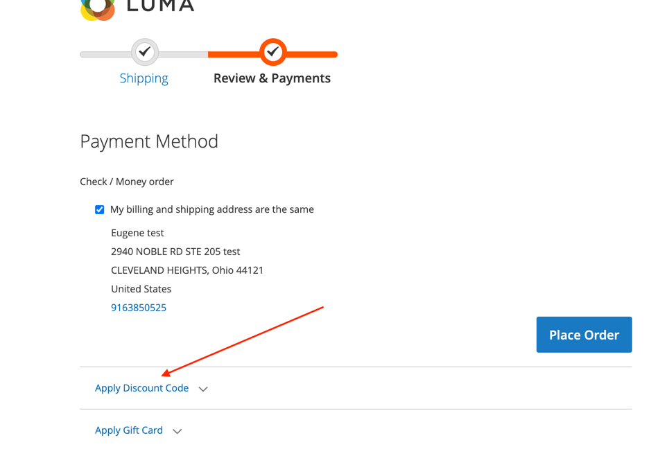
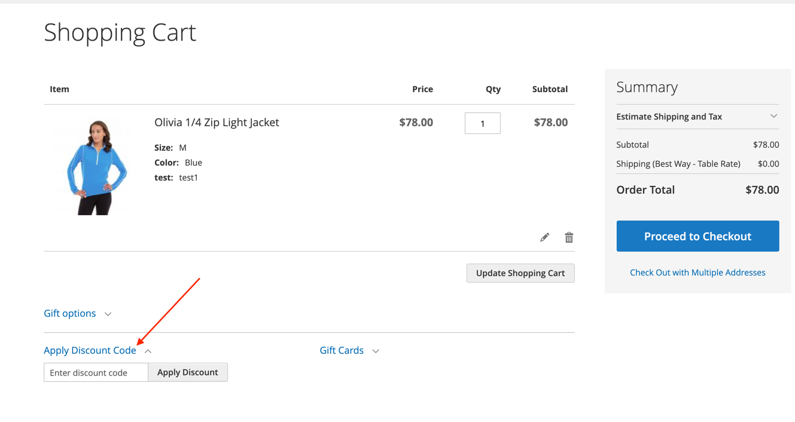

***ReadyToGo_ExpandDiscountCodeBox***

_Task:_ expand discount code box on checkout cart

_Before:_

_After:_

To make this box expanded 

you will need to rewrite this template: Magento_Checkout::cart/coupon.phtml

**To enable this module execute:**

- `composer require eugene-petrov/magento2-expand-discount-code-box`
or if the cmd above is not working: `composer config repositories.readyToGoExpandDiscountCodeBox vcs git@github.com:eugene-petrov/magento2-expand-discount-code-box.git`
- `php bin/magento setup:upgrade`
- `php bin/magento cache:clean`

